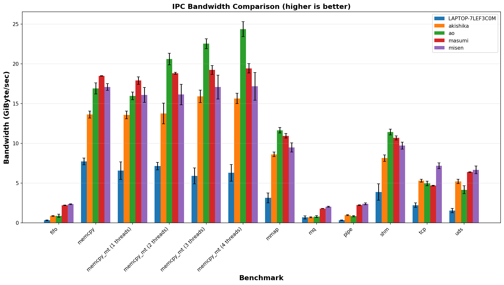
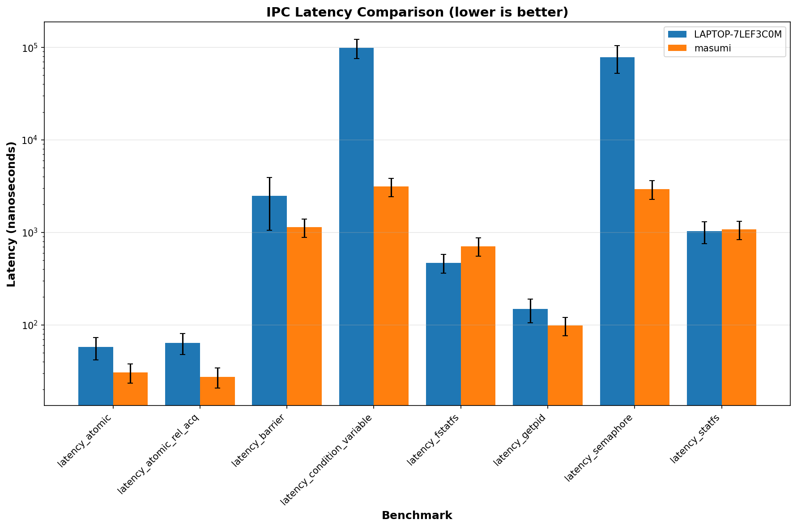

# akbench

`akbench` is a microbenchmark suite for measuring the performance of system calls, memory operations, and inter-process communication (IPC) mechanisms.

> [!WARNING]
> I'm not sure for some numbers of this benchmark. Please use this tool with your own responsibility.

## Result Examples



## How to build and install
You need `cmake`, `git`, and `clang++` (upper than 18) or `g++` (upper than 14) to build this project.

```bash
$ git clone https://github.com/akawashiro/akbench.git
$ cd akbench
$ cmake -S . -B build -D CMAKE_CXX_COMPILER=clang++
$ cmake --build build
$ cmake --install build # If you want to install globally
```

## How to run
```bash
$ ./build/akbench/akbench all
Running all latency tests:

latency_atomic: 30.603 ± 7.456 ns
latency_atomic_rel_acq: 28.425 ± 6.766 ns
latency_barrier: 1207.463 ± 501.146 ns
latency_condition_variable: 3154.424 ± 707.784 ns
latency_semaphore: 2962.199 ± 681.565 ns
latency_statfs: 1008.512 ± 225.512 ns
latency_fstatfs: 664.642 ± 148.630 ns
latency_getpid: 95.559 ± 21.436 ns

Running all bandwidth tests:

bandwidth_memcpy: 17.957 ± 0.440 GiByte/sec
bandwidth_memcpy_mt (1 threads): 17.916 ± 0.144 GiByte/sec
bandwidth_memcpy_mt (2 threads): 18.394 ± 0.189 GiByte/sec
bandwidth_memcpy_mt (3 threads): 19.081 ± 0.356 GiByte/sec
bandwidth_memcpy_mt (4 threads): 18.730 ± 0.563 GiByte/sec
bandwidth_tcp: 4.914 ± 0.395 GiByte/sec
bandwidth_uds: 6.684 ± 0.731 GiByte/sec
bandwidth_pipe: 2.143 ± 0.021 GiByte/sec
bandwidth_fifo: 2.100 ± 0.035 GiByte/sec
bandwidth_mq: 1.758 ± 0.021 GiByte/sec
bandwidth_mmap: 10.238 ± 0.120 GiByte/sec
bandwidth_shm: 10.470 ± 0.185 GiByte/sec
```

## Usage
```
$ ./build/akbench/akbench --help
Usage: akbench <TYPE> [OPTIONS]

Unified benchmark tool for measuring system performance.

Arguments:
  TYPE                         Benchmark type to run (required)

Latency Tests (measure operation latency in nanoseconds):
  latency_atomic               Atomic variable synchronization between threads
  latency_atomic_rel_acq       Atomic operations with relaxed-acquire memory ordering
  latency_barrier              Barrier between process synchronization.
                               We use this barrier in bandwidth tests.
  latency_condition_variable   Condition variable wait/notify operations
  latency_semaphore            Semaphore wait/post operations
  latency_statfs               statfs() filesystem syscall
  latency_fstatfs              fstatfs() filesystem syscall
  latency_getpid               getpid() syscall
  latency_all                  Run all latency benchmarks

Bandwidth Tests (measure data transfer rate in GiByte/sec):
  bandwidth_memcpy             Memory copy using memcpy()
  bandwidth_memcpy_mt          Multi-threaded memory copy
  bandwidth_tcp                TCP socket communication
  bandwidth_uds                Unix domain socket communication
  bandwidth_pipe               Anonymous pipe communication
  bandwidth_fifo               Named pipe (FIFO) communication
  bandwidth_mq                 POSIX message queue communication
  bandwidth_mmap               Memory-mapped file communication
                               Use double buffering.
  bandwidth_shm                Shared memory communication.
                               Use double buffering.
  bandwidth_all                Run all bandwidth benchmarks

Combined:
  all                          Run all latency and bandwidth benchmarks

Options:
  -i, --num-iterations=N       Number of measurement iterations (default: 10)
  -w, --num-warmups=N          Number of warmup iterations (default: 3)
  -l, --loop-size=N            Loop size for latency tests
                               The default value varies depending on the test.
  -d, --data-size=SIZE         Data size in bytes for bandwidth tests (default: 1GB)
  -b, --buffer-size=SIZE       Buffer size in bytes for I/O operations (default: 1MB)
                               Not applicable to memcpy benchmarks
  -n, --num-threads=N          Number of threads for bandwidth_memcpy_mt
      --log-level=LEVEL        Log level: INFO, DEBUG, WARNING, ERROR (default: WARNING)
  -h, --help                   Display this help message
```


